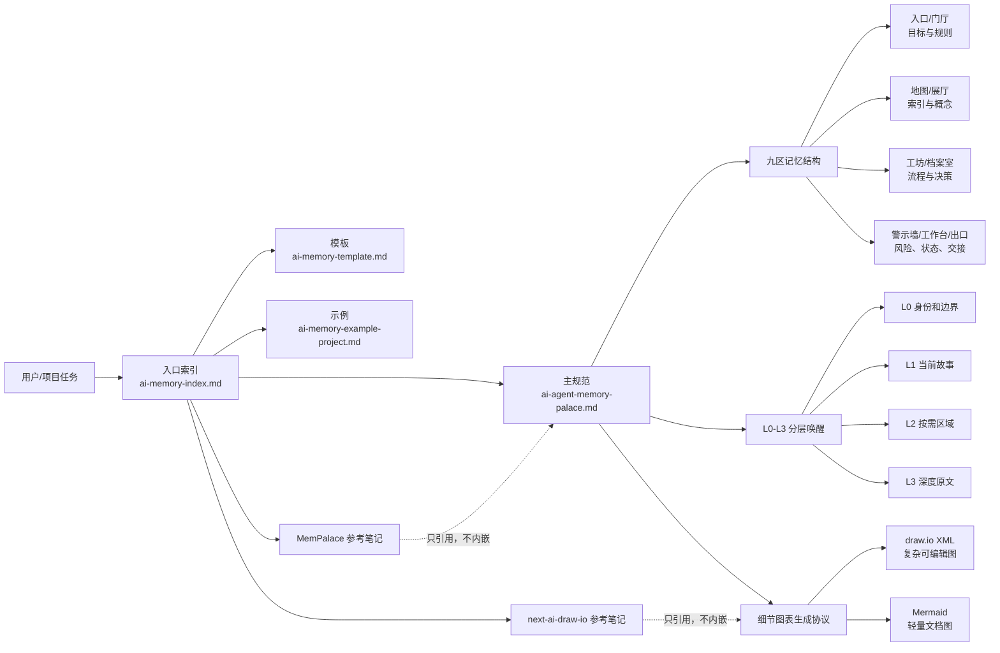
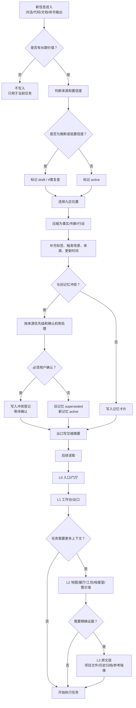
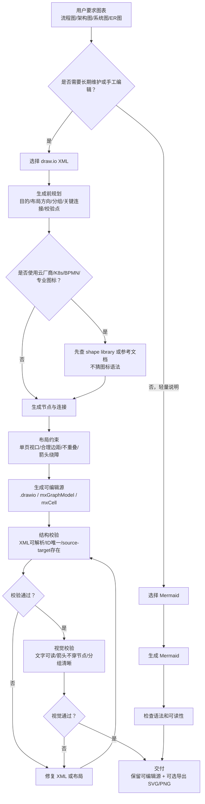

# AI/Agent 记忆宫殿图表产物

更新时间：2026-05-12
用途：展示“记忆宫殿SKILL”的架构、记忆流转和细节图表生成流程。
可编辑源：同目录下的 `.drawio` 文件。

## 1. SKILL 架构图

```mermaid
flowchart LR
    U["用户/项目任务"] --> E["入口索引<br/>ai-memory-index.md"]
    E --> S["主规范<br/>ai-agent-memory-palace.md"]
    E --> T["模板<br/>ai-memory-template.md"]
    E --> X["示例<br/>ai-memory-example-project.md"]
    E --> R1["MemPalace 参考笔记"]
    E --> R2["next-ai-draw-io 参考笔记"]

    S --> Z["九区记忆结构"]
    Z --> Z1["入口/门厅<br/>目标与规则"]
    Z --> Z2["地图/展厅<br/>索引与概念"]
    Z --> Z3["工坊/档案室<br/>流程与决策"]
    Z --> Z4["警示墙/工作台/出口<br/>风险、状态、交接"]

    S --> L["L0-L3 分层唤醒"]
    L --> L0["L0 身份和边界"]
    L --> L1["L1 当前故事"]
    L --> L2["L2 按需区域"]
    L --> L3["L3 深度原文"]

    S --> G["细节图表生成协议"]
    G --> G1["draw.io XML<br/>复杂可编辑图"]
    G --> G2["Mermaid<br/>轻量文档图"]

    R1 -. "只引用，不内嵌" .-> S
    R2 -. "只引用，不内嵌" .-> G
```

## 2. 记忆写入与读取流程图

```mermaid
flowchart TD
    A["新信息进入<br/>对话/代码/文档/命令输出"] --> B{"是否有长期价值？"}
    B -- "否" --> B0["不写入<br/>只用于当前任务"]
    B -- "是" --> C["判断来源和置信度"]
    C --> D{"是否为推断或低置信度？"}
    D -- "是" --> D1["标记 draft / #需复查"]
    D -- "否" --> D2["标记 active"]

    D1 --> E["选择九区位置"]
    D2 --> E
    E --> F["压缩为事实/判断/行动"]
    F --> G["补充标签、触发场景、来源、更新时间"]
    G --> H{"与旧记忆冲突？"}
    H -- "否" --> I["写入记忆卡片"]
    H -- "是" --> J["按来源优先级和确认机制处理"]
    J --> J1{"必须用户确认？"}
    J1 -- "是" --> J2["写入冲突登记<br/>等待确认"]
    J1 -- "否" --> J3["旧记忆 superseded<br/>新记忆 active"]
    J2 --> K["出口写交接摘要"]
    J3 --> K
    I --> K

    K --> R["后续读取"]
    R --> R0["L0 入口/门厅"]
    R0 --> R1["L1 工作台/出口"]
    R1 --> R2{"任务需要更多上下文？"}
    R2 -- "是" --> R3["L2 地图/展厅/工坊/档案室/警示墙"]
    R2 -- "否" --> R5["开始执行任务"]
    R3 --> R4{"需要精确证据？"}
    R4 -- "是" --> R6["L3 原文层<br/>项目文件/历史归档/参考链接"]
    R4 -- "否" --> R5
    R6 --> R5
```

## 3. 细节流程图/架构图生成流程

```mermaid
flowchart TD
    A["用户要求图表<br/>流程图/架构图/系统图/ER图"] --> B{"是否需要长期维护或手工编辑？"}
    B -- "是" --> C["选择 draw.io XML"]
    B -- "否，轻量说明" --> M["选择 Mermaid"]

    C --> D["生成前规划<br/>目的/布局方向/分组/关键连接/校验点"]
    D --> E{"是否使用云厂商/K8s/BPMN/专业图标？"}
    E -- "是" --> E1["先查 shape library 或参考文档<br/>不猜图标语法"]
    E -- "否" --> F["生成节点与连接"]
    E1 --> F

    F --> G["布局约束<br/>单页视口/合理边距/不重叠/箭头绕障"]
    G --> H["生成可编辑源<br/>.drawio / mxGraphModel / mxCell"]
    H --> I["结构校验<br/>XML可解析/ID唯一/source-target存在"]
    I --> J{"校验通过？"}
    J -- "否" --> J1["修复 XML 或布局"]
    J1 --> I
    J -- "是" --> K["视觉校验<br/>文字可读/箭头不穿节点/分组清晰"]
    K --> L{"视觉通过？"}
    L -- "否" --> J1
    L -- "是" --> N["交付<br/>保留可编辑源 + 可选导出 SVG/PNG"]

    M --> M1["生成 Mermaid"]
    M1 --> M2["检查语法和可读性"]
    M2 --> N
```

